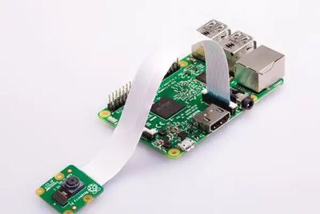

# CSI camera on Raspberry Pi



[CSI Camera V2](https://www.raspberrypi.com/products/camera-module-v2/)
as of Sat 23 Mar 08:47:12 UTC 2024.

Example for newer operating systems (commands `libcamera` or `rpicam-still`):

- copy `csi.dist` as `.env` if you want to use Raspberry Pi camera
- in copied file `.env` replace `token-change-me` with the value of the token
  you copied
- in copied file `.env` replace `fingerprint-change-me` with some random value,
  which is alphanumeric and has at least 16 chars (and max of 40 chars),
  for example set it to `fingerprint-myprinter-camera-1`
- save edited file `.env`

Next, [test config](./test.config.md).

## Real example

My Rpi Zero W with Raspberry Pi Camera v2 with
[maximum resolution](./configuration.tuning.md) available:

<!-- markdownlint-disable line_length -->
```shell
PRINTER_ADDRESS=192.168.1.25
PRUSA_CONNECT_CAMERA_TOKEN=redacted
PRUSA_CONNECT_CAMERA_FINGERPRINT=c10eb887-f107-41a4-900e-2c38ea12a11c
CAMERA_DEVICE=/dev/video0
CAMERA_COMMAND=rpicam-still
CAMERA_COMMAND_EXTRA_PARAMS="--immediate --nopreview --mode 2592:1944:12:P --lores-width 0 --lores-height 0 --thumb none -o"
```
<!-- markdownlint-enable line_length -->
