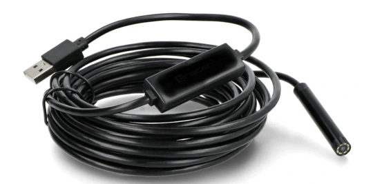

# USB camera



This should work on any linux distro with any sane camera that you have.

## How to get info which cameras are available?

Run `v4l2-ctl --list-devices`.

This should show list of devices to use,  where `/dev/video0` is a device
name.

Notice that not every device is an actual camera.

## How to get what modes are available for the camera?

The quick all-in one output for camera `/dev/video0` is

```shell
v4l2-ctl -d /dev/video0 --all
```

For more details about formats it is better to use
`v4l2-ctl --list-formats-ext -d /dev/video0`

## Prepare config

- copy `usb.dist` as `.env`
- in copied file `.env` replace `token-change-me` with the value of the token
  you copied
- in copied file `.env` replace `fingerprint-change-me` with some random value,
  which is alphanumeric and has at least 16 chars (and max of 40 chars),
  for example set it to `fingerprint-myprinter2-camera-2`
- in copied file `.env` replace  `/dev/video0` with desired device in `CAMERA_DEVICE`
- save edited file `.env`

Next, [test config](./test.config.md).

Note: if you have more cameras you probably want to use device by-id or by-path,
see [tuning](./configuration.tuning.md) for more details.

## Real world example

Raspberry Pi Zero W with endoscope camera over USB, registered as `/dev/video1`:

<!-- markdownlint-disable line_length -->
```shell
PRINTER_ADDRESS=192.168.1.25
PRUSA_CONNECT_CAMERA_TOKEN=redacted
PRUSA_CONNECT_CAMERA_FINGERPRINT=7054ba85-bc19-4eb9-badc-6129575d9651
CAMERA_DEVICE=/dev/video1
CAMERA_COMMAND=fswebcam
CAMERA_COMMAND_EXTRA_PARAMS="--resolution 1280x960 --no-banner"
```
<!-- markdownlint-enable line_length -->

Microsoft LifeCam HD-3000, USB, to avoid image capture tearing we skip first 10
frames `-S 10` which also helps to set up proper auto exposure and white balance.

<!-- markdownlint-disable line_length -->
```shell
PRINTER_ADDRESS=192.168.1.25
PRUSA_CONNECT_CAMERA_TOKEN=redacted
PRUSA_CONNECT_CAMERA_FINGERPRINT=7054ba85-bc19-4eb9-badc-6129575d9651
CAMERA_DEVICE=/dev/video4
CAMERA_COMMAND=fswebcam
CAMERA_COMMAND_EXTRA_PARAMS="-S 10 --resolution 1280x720 --no-banner -s auto_exposure=1,brightness=128,contrast=5"
```
<!-- markdownlint-enable line_length -->
