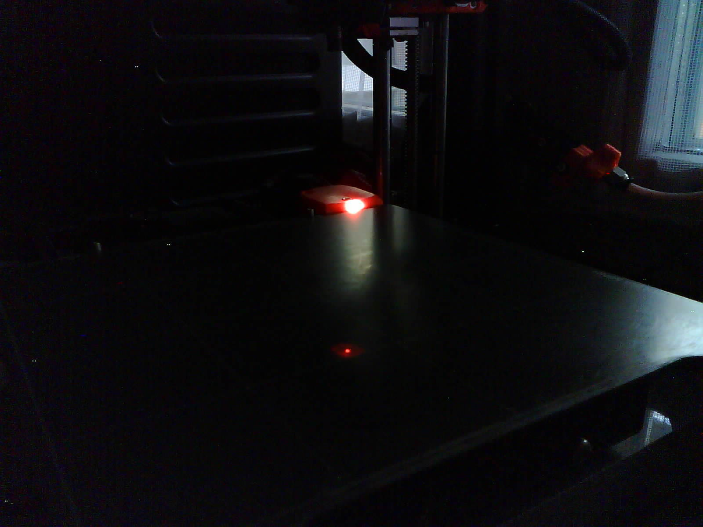
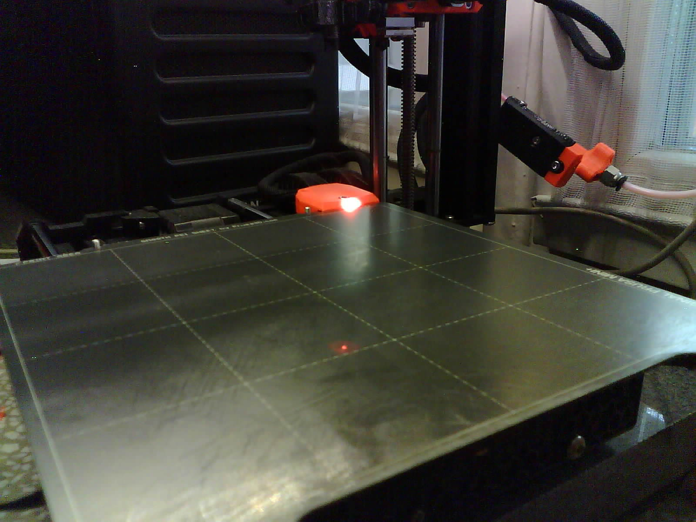
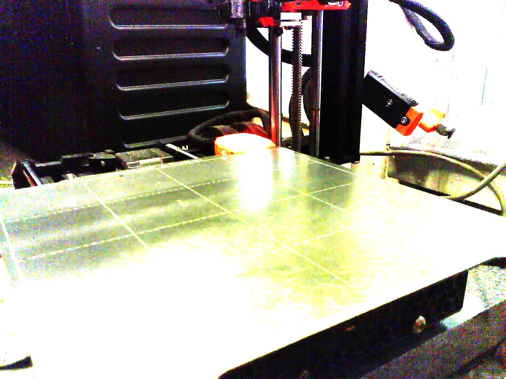
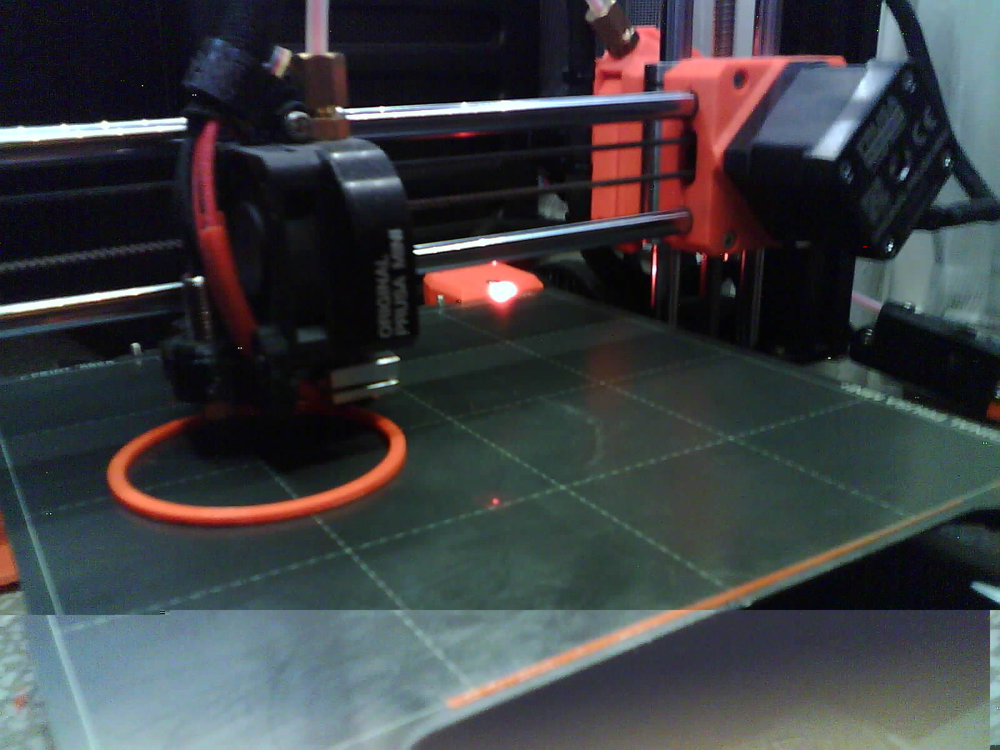
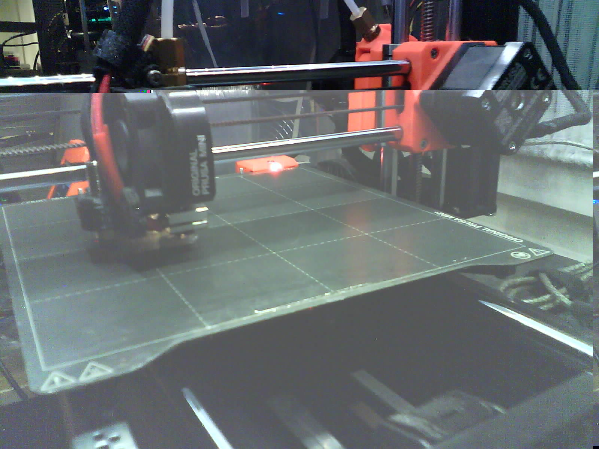
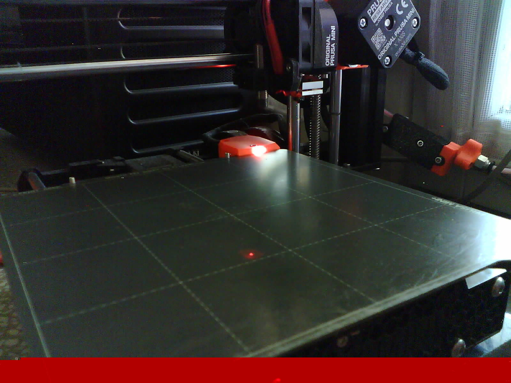
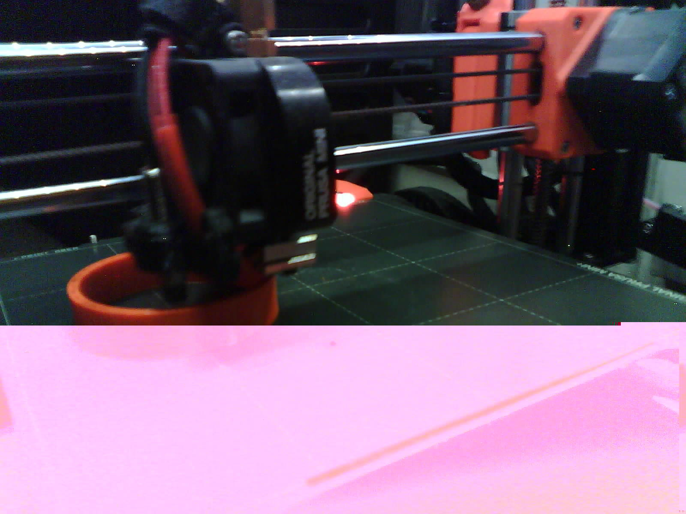

# Configuration tuning

Assuming you already have a working camera with basic setup, we can tune it further.

Below steps depend on the camera capabilities, thus your mileage may vary.

Notice that Prusa Connect has file size limit something about 8MB of the image uploaded,
so there may be no point in getting images with super high resolutions.

## Using predicable camera device names

Somethimes devices change their id so once given camera is under `/dev/video1`
while another restart and it is under `/dev/video2` and swaps with another one.

If you want to have a predictable camera identifiers then see directory
`/dev/v4l/by-id` or `/dev/v4l/by-path` and choose the one that you prefer

Example on Rasberry Pi with CSI camera and two USB cameras:

```text
pi@hormex:~ $ tree /dev/v4l
/dev/v4l
├── by-id
│   ├── usb-Generic_USB_Camera_200901010001-video-index0 -> ../../video3
│   ├── usb-Generic_USB_Camera_200901010001-video-index1 -> ../../video4
│   ├── usb-Microsoft_Microsoft®_LifeCam_HD-3000-video-index0 -> ../../video1
│   └── usb-Microsoft_Microsoft®_LifeCam_HD-3000-video-index1 -> ../../video2
└── by-path
    ├── platform-bcm2835-codec-video-index0 -> ../../video18
    ├── platform-bcm2835-isp-video-index0 -> ../../video20
    ├── platform-bcm2835-isp-video-index1 -> ../../video21
    ├── platform-bcm2835-isp-video-index2 -> ../../video22
    ├── platform-bcm2835-isp-video-index3 -> ../../video23
    ├── platform-fd500000.pcie-pci-0000:01:00.0-usb-0:1.3:1.0-video-index0 -> ../../video3
    ├── platform-fd500000.pcie-pci-0000:01:00.0-usb-0:1.3:1.0-video-index1 -> ../../video4
    ├── platform-fd500000.pcie-pci-0000:01:00.0-usb-0:1.4:1.0-video-index0 -> ../../video1
    ├── platform-fd500000.pcie-pci-0000:01:00.0-usb-0:1.4:1.0-video-index1 -> ../../video2
    ├── platform-fe801000.csi-video-index0 -> ../../video0
    └── platform-feb10000.codec-video-index0 -> ../../video19
```

so now if I want to have a Camera-1 always to point to the LifeCam_HD-3000
I can use:

```shell
CAMERA_DEVICE=/dev/v4l/by-id/usb-Microsoft_Microsoft®_LifeCam_HD-3000-video-index0
```

and for CSI camera (notice it is not available under `by-id`):

```shell
CAMERA_DEVICE=/dev/v4l/by-path/platform-fe801000.csi-video-index0
```

## Getting higher quality camera images

Use `v4l2-ctl` to get the list of available resolutions that camera provides
and then update it in the env var configs.

Run `v4l2-ctl --list-formats-ext -d /dev/video0` where `/dev/video0` is a device
listed from command above.

Example output:

```text
v4l2-ctl --list-formats-ext -d /dev/video1
ioctl: VIDIOC_ENUM_FMT
  Type: Video Capture

  [0]: 'MJPG' (Motion-JPEG, compressed)
    Size: Discrete 640x480
      Interval: Discrete 0.033s (30.000 fps)
      Interval: Discrete 0.033s (30.000 fps)
    Size: Discrete 640x360
      Interval: Discrete 0.033s (30.000 fps)
    Size: Discrete 352x288
      Interval: Discrete 0.033s (30.000 fps)
    Size: Discrete 320x240
      Interval: Discrete 0.033s (30.000 fps)
    Size: Discrete 176x144
      Interval: Discrete 0.033s (30.000 fps)
    Size: Discrete 160x120
      Interval: Discrete 0.033s (30.000 fps)
    Size: Discrete 800x600
      Interval: Discrete 0.033s (30.000 fps)
    Size: Discrete 1280x720
      Interval: Discrete 0.033s (30.000 fps)
    Size: Discrete 1280x960
      Interval: Discrete 0.033s (30.000 fps)
    Size: Discrete 640x480
      Interval: Discrete 0.033s (30.000 fps)
      Interval: Discrete 0.033s (30.000 fps)
  [1]: 'YUYV' (YUYV 4:2:2)
    Size: Discrete 640x480
      Interval: Discrete 0.033s (30.000 fps)
      Interval: Discrete 0.033s (30.000 fps)
    Size: Discrete 640x360
      Interval: Discrete 0.033s (30.000 fps)
    Size: Discrete 352x288
      Interval: Discrete 0.033s (30.000 fps)
    Size: Discrete 320x240
      Interval: Discrete 0.033s (30.000 fps)
    Size: Discrete 176x144
      Interval: Discrete 0.033s (30.000 fps)
    Size: Discrete 160x120
      Interval: Discrete 0.033s (30.000 fps)
    Size: Discrete 800x600
      Interval: Discrete 0.200s (5.000 fps)
    Size: Discrete 1280x720
      Interval: Discrete 0.200s (5.000 fps)
    Size: Discrete 1280x960
      Interval: Discrete 0.200s (5.000 fps)
    Size: Discrete 640x480
      Interval: Discrete 0.033s (30.000 fps)
      Interval: Discrete 0.033s (30.000 fps)
```

As you can see if I set video to YUYV and with resolution higher than 800x600
I would get only 5 frames per second.
For still images this is not a problem, but for video streaming that could be
too low and I would have to switch to MJPG (or actually mjpeg in ffmpeg)

For Raspberry Cam v2 you could use `csi.dist` as source and add
`--mode 2592:1944:12:P` to the `CAMERA_COMMAND_EXTRA_PARAMS`.

For certain USB cameras (such as Tracer Endoscope) you should use `usb.dist` and
you should be able to add `--resolution 1280x960` to the `CAMERA_COMMAND_EXTRA_PARAMS`.

## Setting up video camera controls

Video controls are things like brightness, auto white balance (awb),
exposure and so on.

Get device capabilities, especially `User controls`:

```shell
v4l2-ctl -d /dev/video0 -l
```

Those params can be passed in various ways, depending on the requirement:

* `CAMERA_COMMAND_EXTRA_PARAMS` emv var, when using given tool directly
* `CAMERA_SETUP_COMMAND` env var for some complex use cases
* other (probably directly via v4l when using ffmpeg, not tested)

and set accordingly parameters you want , you just need to pass them fswebcam,
for example:

`CAMERA_COMMAND_EXTRA_PARAMS=--resolution 1280x960 --no-banner -s auto_exposure=1,brightness=128,contrast=5`

For more advanced options see `CAMERA_SETUP_COMMAND` env var, for example:

```shell
CAMERA_SETUP_COMMAND="v4l2-ctl --set-ctrl brightness=64,gamma=300 -d $CAMERA_DEVICE"
```

remember to restart given camera service.

You can try to use `guvcview` desktop application to check prams in realtime.

## Image issues

If your captured image has below issues:

* the whole image is too dark or too bright and it changes with every capture
  so it get too dark or too bright in a matter of minutes:
  
  
  

* has some horizontal/vertical super bright/dark areas:
  
  

* some visible artifacts such as colored blocks or missing image fragments:
  
  
  

then you may need to initialize camera and capture it with a delay
or drop initial number of frames.

Notice that sometimes you cannot do much about it (remote cams) because some
camera images will be broken anyway, then I suggest changing camera.

### Dropping frames

Usually this is the fastest and with `fswebcam` it can be achieved by passing `-S`
param, for example

`-S 10` will skip 10 first frames.

### Delay

`fswebcam`  param `-d 2` will delay capture for 2 seconds, for some cameras it may
help.

## Image flip and rotation

You can pass on params to rpicam-still or fswebcam as you want.

### rpicam-still

See `rpicam-still --help`

```text
  --hflip      Read out with horizontal mirror
  --vflip      Read out with vertical flip
  --rotation   Use hflip and vflip to create the given rotation <angle>
```

so for example:

```shell
CAMERA_COMMAND=rpicam-still
CAMERA_COMMAND_EXTRA_PARAMS="--rotation 90 --immediate --nopreview --thumb none -o"
```

### fswebcam

See `fswebcam --help`

```text
  --flip <direction>       Flips the image. (h, v)
  --crop <size>[,<offset>] Crop a part of the image.
  --scale <size>           Scales the image.
  --rotate <angle>         Rotates the image in right angles.
```

so for example:

```shell
CAMERA_COMMAND=fswebcam
CAMERA_COMMAND_EXTRA_PARAMS="--flip v --resolution 640x480 --no-banner"
```

or to skip first 10 frames (`-S 10`, helps to get proper auto white balance and
image exposure) and pass on camera controls:

```shell
CAMERA_COMMAND=fswebcam
CAMERA_COMMAND_EXTRA_PARAMS="-S 10 --resolution 1280x720 --no-banner -s auto_exposure=1,brightness=128,contrast=5"
```

## ffmpeg

When curl is not enough and you don't really want to physically rotate your camera,
then use ffmpeg for post processing.
You can process static images with it, load v4l2 devices... whatever.

With ffmpeg you can do interesting things with filters, it will just require
more computing power.

### Adding v4l2 options

`v4l2` can be used as alias for `video4linux2`.

You can pass video4linux options to ffmpeg on device initialization, for example:

<!-- markdownlint-disable line_length -->
```shell
ffmpeg -f v4l2 -pix_fmt mjpeg -video_size 1280x960 -framerate 30 -i /dev/video1 \
  -c:v libx264 -preset ultrafast -b:v 6000k -f rtsp rtsp://localhost:$RTSP_PORT/$MTX_PATH
```
<!-- markdownlint-enable line_length -->

would instruct ffmpeg to use video4linux and force it to talk to the camera under
/dev/video1 and forcing mjpeg encoder, resolution and framerate.

This command above is directly taken from [mediamtx](./stream.mediamtx.md).

For more params, see [official ffmpeg docs](https://ffmpeg.org/ffmpeg-devices.html#video4linux2_002c-v4l2).
Just remember to pass them before defining input (`-i /dev/video1`).

### Rotation

See [here](https://superuser.com/questions/578321/how-can-i-rotate-a-video-180-with-ffmpeg)
for basic ones.

You probably want to use `-vf "transpose=1"` to rotate image 90 degrees clockwise:
<!-- markdownlint-disable line_length -->
```shell
CAMERA_COMMAND=ffmpeg
CAMERA_COMMAND_EXTRA_PARAMS="-y -i 'http://esp32-wrover-0461c8.local:8080/' -vf 'transpose=1' -vframes 1 -q:v 1 -f image2 -update 1 "
```
<!-- markdownlint-disable line_length -->

### Other processing

Frankly speaking you can do anything you want with ffmpeg, for example

`-vf transpose=1,shufflepixels=m=block:height=16:width=16`

Why? why not :D
